!SLIDE center

# The Chrome Developer Tools

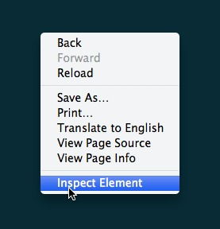

!SLIDE center

# Insane

!SLIDE center

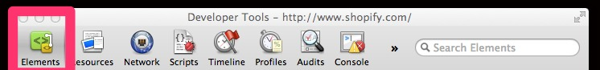

!SLIDE center

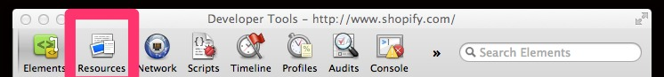

!SLIDE center

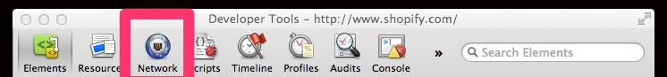

!SLIDE center

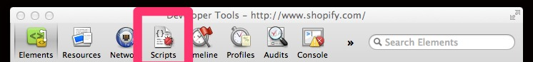

!SLIDE center

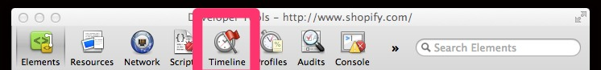

!SLIDE center

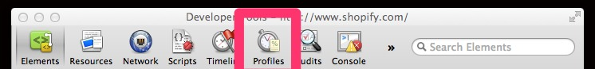

!SLIDE center

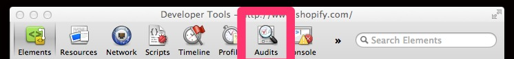

!SLIDE center

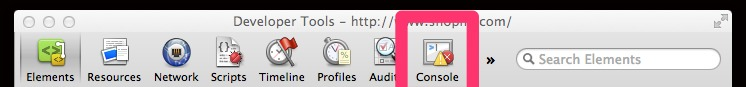

!SLIDE center

# I say don't use the console panel.

!SLIDE center

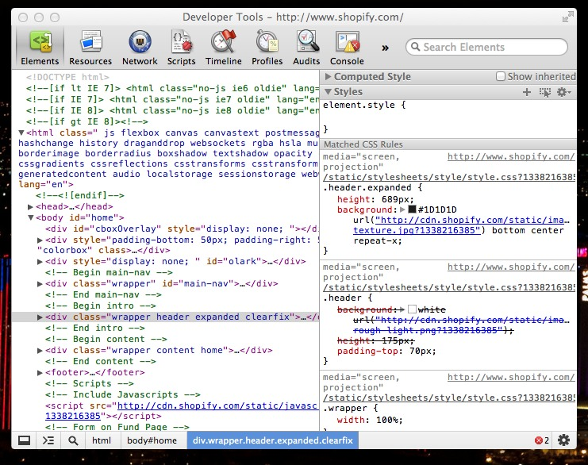

!SLIDE center

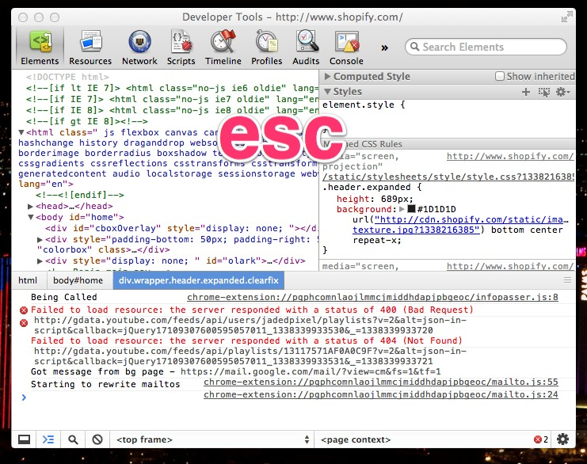

!SLIDE center takeaway

# Press the `Escape` key to bring up the console on any panel.

!SLIDE center

# Window toggle

!SLIDE center

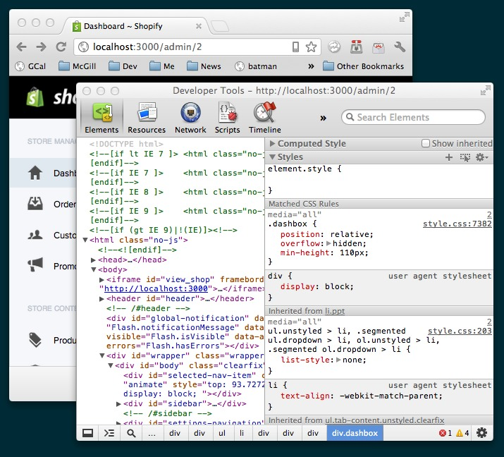

!SLIDE center

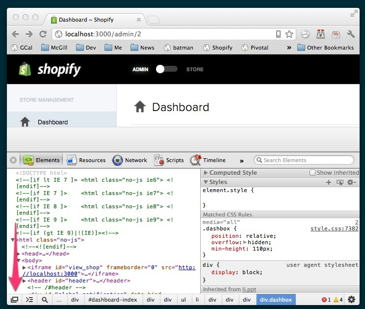

!SLIDE center

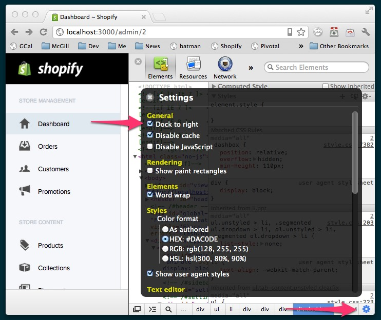

!SLIDE center

# Settings

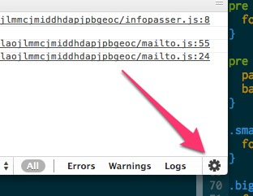

!SLIDE incremental

# Keyboard shortcuts

 - `⌥⌘I` to toggle Developer Tools
 - `⌥⌘J` to toggle Console
 - `?` on any Developer Tools window to see the available shortcuts
 - `⌘F` to focus the Search bar
 - and more
